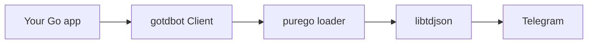

<p align="center">
  
</p>

<p align="center">
  
</p>

<p align="center">
  
</p>

<p align="center">
  <a href="https://github.com/Iotatg/gotdbot/stargazers"></a>
  <a href="https://github.com/Iotatg/gotdbot/network/members"></a>
  <a href="https://pkg.go.dev/github.com/Iotatg/gotdbot"></a>
  <a href="https://github.com/Iotatg/gotdbot/blob/main/LICENSE"></a>
  
  
  
</p>

<p align="center">
  
</p>

<p align="center">
  <b>gotdbot</b> is a pure Go wrapper for <a href="https://github.com/tdlib/td">TDLib</a>.<br/>
  Idiomatic APIs, generated types, and zero CGO — built for Telegram bots and user clients.
</p>

<p align="center">
  <a href="#installation">Install</a> ·
  <a href="#quick-start">Quick Start</a> ·
  <a href="#features">Features</a> ·
  <a href="#architecture">Architecture</a> ·
  <a href="#examples">Examples</a> ·
  <a href="#license">License</a>
</p>

<p align="center">
  
</p>

## Features

<table>
  <tr>
    <td width="50%" valign="top">
      <b>Pure Go</b><br/>
      Loads <code>libtdjson</code> with <code>purego</code>. No C compiler, no CGO flags.
    </td>
    <td width="50%" valign="top">
      <b>Type-safe API</b><br/>
      100% generated Go structs and methods for every TDLib type and function.
    </td>
  </tr>
  <tr>
    <td width="50%" valign="top">
      <b>High performance</b><br/>
      Direct JSON binding to TDLib with minimal overhead on the hot path.
    </td>
    <td width="50%" valign="top">
      <b>Composable filters</b><br/>
      Match private chats, incoming messages, callbacks, and more with combinators.
    </td>
  </tr>
  <tr>
    <td width="50%" valign="top">
      <b>Conversations</b><br/>
      Built-in <code>Ask</code> / wait helpers for sequential multi-step flows.
    </td>
    <td width="50%" valign="top">
      <b>Bots and users</b><br/>
      Bot tokens, phone login, QR code, and 2FA on the same client.
    </td>
  </tr>
</table>

<p align="center">
  
</p>

## Architecture



Updates flow back the same path. Handlers, filters, and conversations sit on the client — you never talk to TDLib JSON by hand.

<p align="center">
  
</p>

## Installation

```bash
go get github.com/Iotatg/gotdbot
```

### Requirements

| Tool | Version |
|------|---------|
| Go | 1.27.1 or newer |
| TDLib | compiled `libtdjson` shared library |

<details>
<summary><b>Quick TDLib setup</b></summary>

Download precompiled binaries from [tdlib-build](https://github.com/FallenProjects/tdlib-build/releases):

```bash
go run github.com/Iotatg/gotdbot/scripts/tools
```

</details>

<p align="center">
  
</p>

## Quick Start

```go
package main

import (
	"log"

	"github.com/Iotatg/gotdbot"
)

func main() {
	bot, err := gotdbot.NewClient(12345, "YOUR_API_HASH", "YOUR_BOT_TOKEN", nil)
	if err != nil {
		log.Fatalf("Failed to create client: %v", err)
	}

	bot.OnCommand("start", func(c *gotdbot.Client, u *gotdbot.Message) error {
		_, err := u.ReplyText(c, "Hello! I am powered by gotdbot.", nil)
		return err
	})

	bot.OnMessage(func(c *gotdbot.Client, u *gotdbot.Message) error {
		_, err := c.ForwardMessages(u.ChatId, u.ChatId, []int64{u.Id}, &gotdbot.ForwardMessagesOpts{SendCopy: true})
		return err
	}, nil)

	if err := bot.Start(); err != nil {
		log.Fatalf("Failed to start bot: %v", err)
	}

	bot.Idle()
}
```

<p align="center">
  
</p>

## Advanced Usage

<details>
<summary><b>Composable filters</b></summary>

```go
import (
	"github.com/Iotatg/gotdbot/filters/message"
)

bot.OnMessage(handlePrivate, message.And(message.Private, message.Incoming))
```

Filter packages:

- `github.com/Iotatg/gotdbot/filters/message` — `gotdbot.Message`
- `github.com/Iotatg/gotdbot/filters/callbackquery` — `gotdbot.UpdateNewCallbackQuery`

</details>

<details>
<summary><b>Conversations</b></summary>

```go
bot.OnCommand("rename", func(c *gotdbot.Client, u *gotdbot.Message) error {
	u.ReplyText(c, "What is your new name?", nil)

	res, err := c.Ask(u.ChatId, &gotdbot.WaitMessageOpts{
		Timeout: 30 * time.Second,
	})
	if err != nil {
		return err
	}

	u.ReplyText(c, "Nice to meet you, "+res.GetText(), nil)
	return nil
})
```

</details>

<details>
<summary><b>Message helpers</b></summary>

```go
msg.ReplyPhoto(c, gotdbot.InputFileLocal{Path: "image.png"}, nil)
msg.Delete(c, true)
msg.Pin(c, false, false)
msg.React(c, []gotdbot.ReactionType{&gotdbot.ReactionTypeEmoji{Emoji: "👍"}}, nil)
```

</details>

<p align="center">
  
</p>

## Examples

| Example | What it shows |
|---------|----------------|
| [Echo Bot](examples/echoBot) | Commands, replies, basic handlers |
| [Conversation Bot](examples/conversation) | `Ask` / wait API |
| [Multi Bot](examples/echoMultiBot) | Multiple clients in one process |

<p align="center">
  
</p>

## Contributing

Default branch is `main`.

1. Fork the project
2. Create a branch: `git checkout -b feat/amazing-feature`
3. Commit your changes
4. Push: `git push origin feat/amazing-feature`
5. Open a pull request against `main`

<p align="center">
  
  
</p>

<p align="center">
  
</p>

## License

MIT License. Copyright (c) 2026 [Iota coder](https://github.com/Iotatg). See [LICENSE](LICENSE).

<p align="center">
  
</p>

<p align="center">
  
</p>
